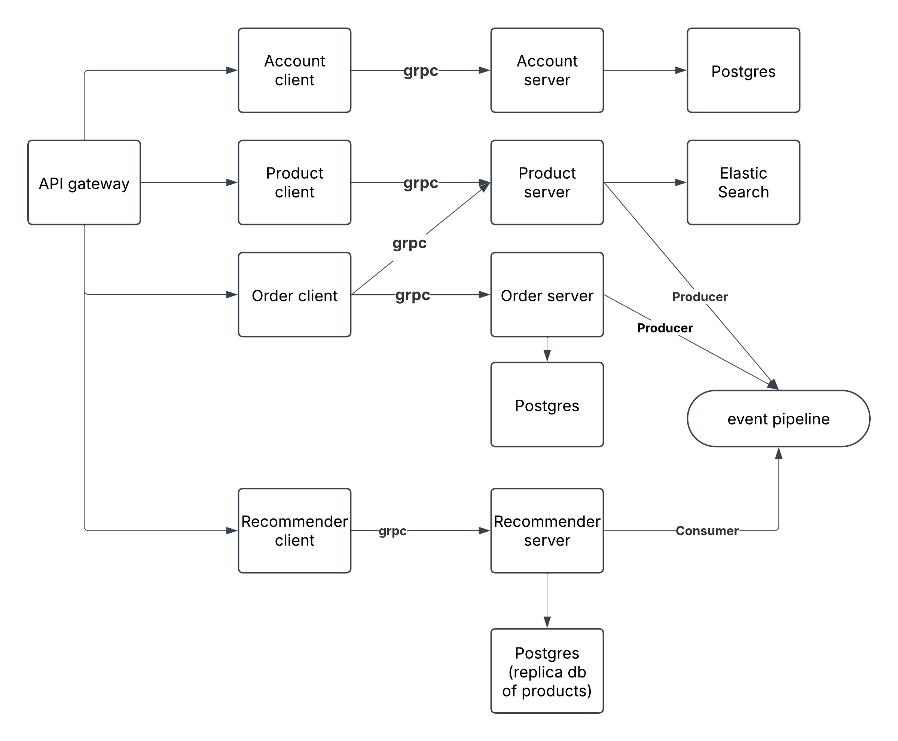

# ECOMMERCE MICROSERVICES

This repository hosts a sample **e-commerce platform** demonstrating a **microservices architecture** using multiple **Go services** alongside a **Python-based Recommender service**. The project showcases:

- gRPC communication between services
- Kafka-based event streaming pipeline
- A unified GraphQL API gateway for clients
- Elasticsearch integration for product search

---

## 📚 Table of Contents

- [Overview](#-overview)
- [Architecture Diagram](#-architecture-diagram)
- [Services](#-services)
- [Getting Started](#-getting-started)
- [Usage](#-usage-graphql)
- [Contributing](#-contributing)
- [Author](#-author)
- [License](#-license)

---

## 🧭 Overview

The system comprises several microservices:

- **Account** (Go): Manages user accounts, authentication, and authorization.
- **Product** (Go): CRUD for products; indexes product data in **Elasticsearch**.
- **Order** (Go): Handles order creation and persistence; publishes events to Kafka.
- **Recommender** (Python): Consumes Kafka events and builds product recommendations.
- **API Gateway** (Go): A GraphQL service exposing a unified API for front-end clients.

The entire ecosystem is containerized using **Docker Compose**. Datastores include **PostgreSQL**, **Elasticsearch**, and **Kafka**.

---

## 🏗 Architecture Diagram

Below is a high-level overview of the system architecture:



### Communication Overview

- `API Gateway (GraphQL)` talks to:
    - `Account client` → `Account server` → `Postgres`
    - `Product client` → `Product server` → `ElasticSearch`
    - `Order client` → `Order server` → `Postgres` + Kafka  
      (also communicates with Product service via gRPC)
    - `Recommender client` → `Recommender server` (Python) → `Postgres (Replica)`

- **Event Flow**:
    - `Order` and `Product` services act as **Kafka producers**.
    - `Recommender` service is a **Kafka consumer**, ingesting order/product events and updating internal state for recommendations.

---

## ⚙ Services

### 🧑‍💼 Account Service (Go)
- Responsibilities: Register, login, fetch account data, generate JWT tokens.
- Database: PostgreSQL

### 📦 Product Service (Go)
- Responsibilities: Product CRUD operations, indexing to Elasticsearch, event publishing to Kafka.
- Database: Elasticsearch

### 🛒 Order Service (Go)
- Responsibilities: Order creation, price calculation, data persistence, Kafka event publishing.
- Dependencies: Calls product service to retrieve product info.

### 🧠 Recommender Service (Python)
- Responsibilities: Kafka consumer that builds recommendations based on product/order events.
- Tech Stack: Python + gRPC + PostgreSQL (replica of product DB)

### 🚪 API Gateway (Go)
- Responsibilities: Unified GraphQL endpoint at `/graphql`.
- Implementation: Uses gRPC clients for all microservices and schema stitching.

---
## 🚀 Getting Started

### ✅ Prerequisites

Before running the project, ensure you have the following installed:

- [Docker](https://www.docker.com/get-started) & [Docker Compose](https://docs.docker.com/compose/)
- [Git](https://git-scm.com/)

---

### 📥 Clone the Repository

```bash
  git clone https://github.com/rasadov/EcommerceAPI.git
  cd ecommercemicroservices
```

---

### 🐳 Run the Stack

To build and start all services using Docker Compose, run:

```bash
  docker-compose up --build
```

This will start:

- Go microservices (`account`, `order`, `product`, `graphql`)
- Python-based `recommender` service
- Databases: PostgreSQL, Elasticsearch
- Kafka + Zookeeper
- GraphQL gateway

---

### 🌐 Access the API

Once everything is running, open your browser to:

- **GraphQL API endpoint**:  
  [http://localhost:8080/graphql](http://localhost:8080/graphql)

- **GraphQL Playground (interactive testing)**:  
  [http://localhost:8080/playground](http://localhost:8080/playground)

---

## 📬 Usage (GraphQL)

Below are example GraphQL queries and mutations you can test in the [GraphQL Playground](http://localhost:8080/playground).

---

### 📝 Register a New Account

```graphql
mutation {
  register(account: {
    name: "Alice"
    email: "alice@example.com"
    password: "secret123"
  }) {
    token
  }
}
```

---

### 🔐 Login

```graphql
mutation {
  login(account: {
    email: "alice@example.com"
    password: "secret123"
  }) {
    token
  }
}
```

---

### ➕ Create a Product

```graphql
mutation {
  createProduct(product: {
    name: "Camera"
    description: "A digital camera"
    price: 99.99
  }) {
    id
    name
  }
}
```

---

### 🔍 Query Products

```graphql
query {
  product(pagination: { skip: 0, take: 10 }) {
    id
    name
    price
  }
}
```

---

### 🛒 Create an Order

```graphql
mutation {
  createOrder(order: {
    products: [
      { id: "PRODUCT_ID", quantity: 2 }
    ]
  }) {
    id
    totalPrice
    products {
      name
      quantity
    }
  }
}
```

## 🤝 Contributing
We welcome contributions! To contribute:

Fork the repository

Create a new branch

Commit and push your changes

Open a Pull Request

## 👤 Author

**Rauf Asadov**  
GitHub: [@rasadov](https://github.com/rasadov)  
LinkedIn: [Rauf Asadov](https://www.linkedin.com/in/rauf-asadov/)  
Email: raufasadov23@gmail.com

## 🪪 License
This project is licensed under the Apache License 2.0.
